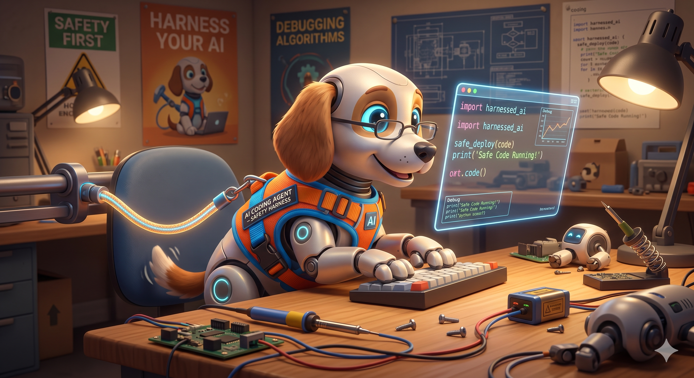
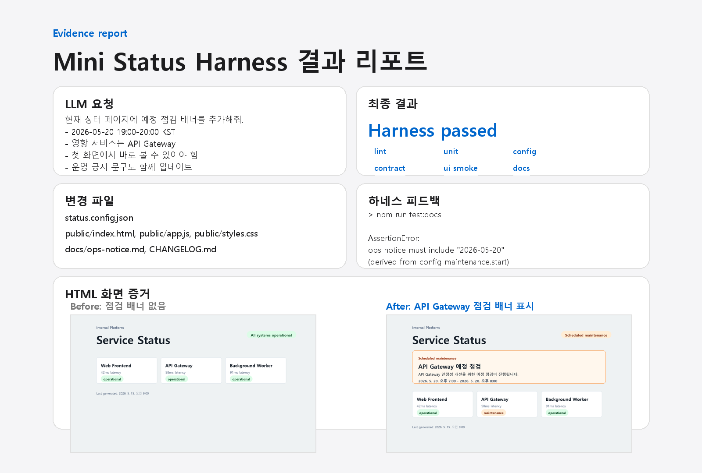

# Harness Engineering

AI가 만든 결과를 조직이 믿을 수 있는 결과로 바꾸는 일

<div class="pipeline">
  <span>AI output</span>
  <b>→</b>
  <span>검증 기준</span>
  <b>→</b>
  <span>trusted engineering result</span>
</div>

<div class="meta">
05/20 · FE/BE 개발자, System Engineer 대상 · 10분
</div>

<!--
0:00-0:25
오늘은 새로운 거창한 방법론 소개가 아니라, AI가 만든 결과를 기존 엔지니어링 흐름에서 어떻게 믿을 수 있는 결과로 바꿀지 이야기한다.
-->

---

# Harness

<div class="harness-pair">
  
  
</div>

<div class="claim">
강아지의 하네스처럼, AI도 제멋대로 움직이지 않게 도와주는 장치가 필요합니다.
</div>

<!--
0:25-0:55
하네스는 원래 강아지가 제멋대로 튀어나가지 않게 잡아주는 장치다. 오늘은 이 개념을 AI 작업에 적용해 보겠다고 연결한다.
-->

---

# 퀴즈

## AI 활용 업무 처리 시 병목은 어디일까요?

<div class="bottleneck-quiz">
  <div class="task-column">
    <div>코드 수정</div>
    <div>테스트 실행</div>
    <div>문서 초안</div>
    <div>설정 변경</div>
  </div>
  <div class="connector-arrow" aria-hidden="true">↔</div>
  <div class="unknown-box">?</div>
  <div class="connector-arrow" aria-hidden="true">↔</div>
  <div class="task-column">
    <div>빌드 결과 확인</div>
    <div>운영 공지</div>
    <div>PR 준비</div>
    <div>배포 전 점검</div>
  </div>
</div>

<!--
0:55-1:20
AI가 할 수 있는 일이 많아질수록 가운데에서 막히는 지점이 어디인지 묻는다. 답은 다음 장.
-->

---

# 정답

<div class="bottleneck-quiz answered">
  <div class="task-column">
    <div>코드 수정</div>
    <div>테스트 실행</div>
    <div>문서 초안</div>
    <div>설정 변경</div>
  </div>
  <div class="connector-arrow" aria-hidden="true">↔</div>
  <div class="unknown-box person">사람</div>
  <div class="connector-arrow" aria-hidden="true">↔</div>
  <div class="task-column">
    <div>빌드 결과 확인</div>
    <div>운영 공지</div>
    <div>PR 준비</div>
    <div>배포 전 점검</div>
  </div>
</div>

<div class="claim">
반복 검증이 사람에게 몰리면 AI를 써도 흐름은 빨라지지 않습니다.
</div>

<!--
1:20-1:50
사람이 빠진다는 이야기가 아니라, 반복 검증을 사람이 계속 들고 있으면 사람이 병목이 된다는 이야기다.
-->

---

# 수동 확인을 자동 검증으로

<div class="before-after">
  <div class="flow-card">
    <h3>Before</h3>
    <p>AI 변경 → 사람이 매번 확인 → 머지/배포</p>
    <span class="badge warn">사람 병목</span>
  </div>
  <div class="flow-card">
    <h3>After</h3>
    <p>AI 변경 → 자동 검증 → 사람은 예외 판단</p>
    <span class="badge ok">흐름 유지</span>
  </div>
</div>

| 사람이 매번 확인 | 자동 검증으로 대체 |
| --- | --- |
| 테스트 돌렸나? | CI 자동 실행 |
| 설정 형식 맞나? | 설정 형식 자동 검사 |
| API 계약 깨졌나? | API 계약 자동 검사 |
| 운영 공지 갱신했나? | 문서/공지 자동 검사 |
| 화면에 보이나? | 화면 표시 자동 검사 |

<div class="note-box">
Harness Engineering은 AI 결과가 팀의 빌드·테스트·리뷰·운영 기준을 지나가게 하는 자동화된 검증 흐름입니다.
</div>

<!--
1:50-2:50
사람이 매번 손으로 확인하던 일을 자동화된 검증 흐름으로 옮긴다. 사람은 모든 변경을 손으로 보는 역할이 아니라, 기준을 설계하고 예외를 판단하는 역할로 이동한다. 별도 정의 슬라이드는 두지 않고 이 한 줄로 정의한다.
-->

---

# 영역별 적용 예시

<div class="role-grid">
  <div><h3>운영/문서</h3><p>운영 공지<br>감사 흔적<br>변경 증거</p></div>
  <div><h3>FE</h3><p>UI smoke<br>접근성<br>화면 regression test</p></div>
  <div><h3>BE</h3><p>API contract<br>migration<br>compatibility</p></div>
  <div><h3>System Engineer</h3><p>빌드 정책<br>권한/감사<br>AI용 CI 피드백</p></div>
</div>

<div class="claim">
각자 자기 업무에서 사람이 반복 확인하는 항목 하나를 자동화 후보로 잡는 것이 시작점입니다.
</div>

<!--
2:50-3:35
비개발자와 운영/문서 관점부터 짚는다. 승인 기준, 운영 공지, 감사 흔적, 변경 증거도 하네스의 대상이라고 말한다.
-->

---

# 공개 자료에서 보이는 공통 패턴

<div class="evidence-lead">
공통점은 에이전트에게 지시만 하는 것이 아니라, 저장소 규칙·훅·CI·리뷰 루프를 함께 제공한다는 점입니다.
</div>

<div class="evidence-grid">
  <div class="evidence-card">
    <h3>OpenAI</h3>
    <p>testing, validation, review, feedback handling, recovery를 시스템에 인코딩</p>
  </div>
  <div class="evidence-card">
    <h3>Claude Code</h3>
    <p><code>CLAUDE.md</code>, hooks, skills로 저장소별 규칙과 반복 작업 제공</p>
  </div>
  <div class="evidence-card">
    <h3>GitHub Copilot</h3>
    <p>GitHub Actions 기반 환경과 PR 흐름 안에서 agent 작업 수행</p>
  </div>
  <div class="evidence-card">
    <h3>DORA / DevOps</h3>
    <p>자동 테스트, 배포 자동화, 빠른 피드백, 수동 단계 감소</p>
  </div>
</div>

<!--
3:35-4:10
용어 자체가 완전히 정착됐다고 말하지 않는다. 다만 공개 자료들이 반복해서 보여주는 패턴은 에이전트 + 저장소 규칙 + 자동 검증 루프다.
-->

---

# 예제를 통한 실습

<div class="mock-grid">
  <div>
    <div class="page-mock">
      <div class="mock-header">
        <span class="mock-eyebrow">Internal Platform</span>
        <span class="mock-title">Service Status</span>
        <span class="mock-pill">All systems normal</span>
      </div>
      <div class="mock-services"><span></span><span></span><span></span><span></span></div>
    </div>
    <p class="mock-caption">현재 — 점검 안내 없음</p>
  </div>
  <div>
    <div class="page-mock">
      <div class="mock-header">
        <span class="mock-eyebrow">Internal Platform</span>
        <span class="mock-title">Service Status</span>
        <span class="mock-pill">All systems normal</span>
      </div>
      <div class="mock-banner">
        <b>Scheduled maintenance</b>
        <span>API Gateway · 2026-05-20 19:00-20:00 KST</span>
      </div>
      <div class="mock-services"><span></span><span></span><span></span><span></span></div>
    </div>
    <p class="mock-caption">목표 — 첫 화면에 점검 배너</p>
  </div>
</div>

<!--
4:10-4:35
작은 예제로 하네스가 어떤 layer를 확인하는지 보겠다고 전환한다.
-->

---

# 요청

<div class="stage-label">AI 요청 문구</div>
<div class="prompt">
현재 상태 페이지에 예정 점검 배너를 추가해줘.<br>
운영 공지, ops audit log, HTML 결과 리포트까지 업데이트하고<br>
완료 전 npm run maintenance:complete를 실행해줘.
</div>

<!--
4:35-4:55
발표장 네트워크에 의존하지 않기 위해 현장 실행 대신 같은 과정을 HTML 슬라이드와 캡처로 재현한다고 전환한다.
-->

---

# 영향 범위

<div class="change-stack">
  <div class="change-card">
    <b>설정</b>
    <span>maintenance.enabled, 일정, 영향 서비스</span>
  </div>
  <div class="change-card">
    <b>화면</b>
    <span>배너 DOM, 렌더러, 토큰 기반 스타일</span>
  </div>
  <div class="change-card">
    <b>운영</b>
    <span>운영 공지, changelog, 감사 로그</span>
  </div>
  <div class="change-card">
    <b>증거</b>
    <span>하네스 로그, 화면 snapshot, HTML 리포트</span>
  </div>
</div>

<div class="claim">
한 요청, 네 곳의 변경 — 하네스가 정합성을 검증합니다.
</div>

<!--
4:55-5:35
AI가 UI만 바꾸면 충분하지 않다. 상태 페이지 변경은 화면, 운영 공지, 감사 로그, 결과 리포트까지 같은 이야기를 해야 한다.
-->

---

# 영역별 검증

| 영역 | 체크 | 보장하는 것 |
| --- | --- | --- |
| 설정 | unit, config, api contract | 도메인 로직·스키마·응답 계약 |
| 화면 | ui smoke, design contract | 배너 DOM·렌더러·디자인 토큰·금지 스타일 |
| 운영 | docs, ops log | 공지·changelog·감사 로그 ↔ config |
| 증거 | report | 리포트 본문·첨부·로그 정합 |

<!--
5:35-5:55
4 영역마다 어떤 체크가 어떤 정합성을 보장하는지 한 장으로. 이 표가 곧 다음 슬라이드에서 도는 하네스의 설정이다.
-->

---

# 최종 검증

```text
> npm run maintenance:complete

lint passed
unit tests passed
config check passed
api contract check passed
ui smoke check passed
docs check passed
design contract check passed
ops log check passed
report check passed
```

<!--
5:35-6:10
현장 실행으로 설명하지 않는다. 이미 수행된 최종 검증 결과로 설명한다.
-->

---

# 결과 리포트

<div class="capture-frame report-capture">
  
</div>

<!--
6:10-6:55
결과 리포트는 사람이 리뷰할 때 필요한 요청, harness 결과, 화면, 운영 공지를 한 장으로 묶는다.
-->

---

# 모델이 좋아지면 하네스는?

<div class="evolution">
  <div class="layer thick">
    <h3>지금</h3>
    <p>장황한 프롬프트<br>사람 체크리스트<br>반복 설명</p>
  </div>
  <div class="arrow">→</div>
  <div class="layer thin">
    <h3>이후</h3>
    <p>테스트와 정책<br>hooks와 skills<br>로그·증거</p>
  </div>
</div>

<div class="claim">
하네스는 한 번 만들고 끝이 아닙니다. 모델이 바뀌면 같이 바뀝니다.
</div>

<!--
6:55-7:45
질문에 정직하게 답한다. 일부는 정말로 불필요해지지만, 그렇기 때문에 모델 변화에 맞춰 계속 갱신해야 한다고 짚는다. SE 차별점은 slide 6으로 이미 옮겼다.
-->

---

# Harness가 천장을 받친다

<div class="final-infographic">
  <p class="lead-quote">"Vibe Coding이 바닥을 올린다면, Agentic Engineering은 천장을 높인다."<cite>— Andrej Karpathy</cite></p>
  <div class="info-card accent ceiling-note">
    천장은 저절로 올라가지 않습니다. AI가 더 많이 만들수록 검증·운영 부담도 같이 늘어나기 때문입니다.
    Harness Engineering은 그 부담을 사람 손이 아닌 자동 검증이 떠안게 만들어, Agentic Engineering의 천장에 실제로 닿게 합니다.
  </div>
  <div class="info-card">
    <h3>AI가 더 많이 구현할수록</h3>
    <p>사람은 코드 작성자보다 문제 정의자, 기준 설계자, 예외 판단자에 가까워집니다.</p>
  </div>
  <div class="info-card">
    <h3>사람에게 남는 책임</h3>
    <p>무엇을 만들지, 어떤 기준을 지킬지, 어떤 예외를 허용할지 결정합니다.</p>
  </div>
  <div class="final-message">
    이번 주에는 같은 질문을 3번 이상 반복한 항목 하나를 자동화 후보로 적어보세요.
  </div>
</div>

<!--
7:45-9:20
Karpathy 인용을 천천히 읽고, 천장은 저절로 올라가지 않는다는 점을 짚는다. 하네스가 그 부담을 자동 검증으로 떠안게 만든다고 연결한 뒤 사람에게 남는 책임과 CTA로 닫는다.
-->

---

# Sources

- OpenAI, Harness Engineering: https://openai.com/index/harness-engineering/
- Anthropic, Claude Code best practices: https://code.claude.com/docs/en/best-practices
- GitHub Docs, Copilot coding agent concepts: https://docs.github.com/en/copilot/concepts/about-copilot-coding-agent
- DORA capabilities: Continuous Delivery, Test Automation, Deployment Automation: https://dora.dev/capabilities/
- Andrej Karpathy, Sequoia Ascent 2026 — From Vibe Coding to Agentic Engineering

<!--
백업 슬라이드. 본문에서는 이름만 언급하고, 질문이 들어오면 출처를 보여준다. Q&A에서는 "용어는 아직 정착 중이지만, 공개 자료들이 가리키는 패턴은 유사하다"라고 말한다.
-->
