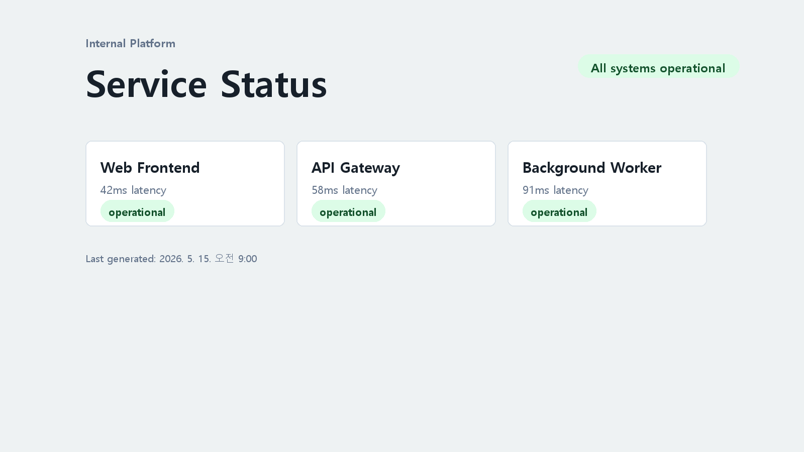
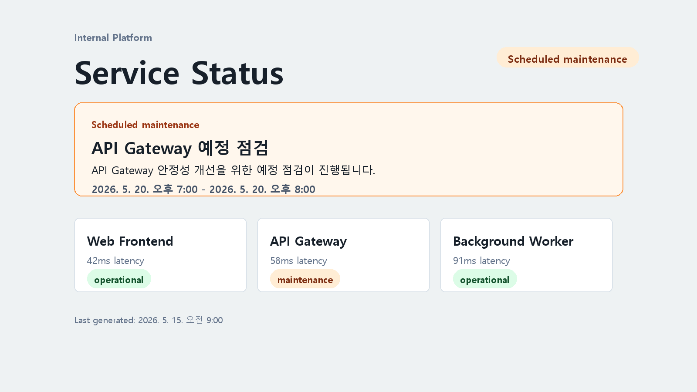

# Harness Engineering

AI가 만든 결과를 조직이 믿을 수 있는 결과로 바꾸는 일

  AI output
  <b>→</b>
  검증 기준
  <b>→</b>
  trusted engineering result

05/20 · FE/BE 개발자, System Engineer 대상 · 10분

<!--
0:00-0:15
오늘은 새로운 거창한 방법론 소개가 아니라, AI가 만든 결과를 기존 엔지니어링 흐름에서 어떻게 믿을 수 있는 결과로 바꿀지 이야기한다.
-->

---

# 퀴즈 1

## 이건 무엇일까요?

  

<!--
0:15-0:30
가볍게 시작한다. 답은 다음 장에서 보여준다.
-->

---

# 퀴즈 1: 정답

  

    
  

  
하네스

<!--
0:30-0:40
하네스는 원래 무언가가 제멋대로 움직이지 않고 안전하게 연결되도록 잡아주는 장치다. 오늘은 AI 결과를 팀의 검증 기준에 연결하는 의미로 쓴다.
-->

---

# 퀴즈 2

## AI 활용 업무 처리 시 병목은 어디일까요?

  

    
코드 수정

    
테스트 실행

    
문서 초안

    
설정 변경

  

  
↔

  
?

  
↔

  

    
빌드 결과 확인

    
운영 공지

    
PR 준비

    
배포 전 점검

  

<!--
0:40-0:55
AI가 할 수 있는 일이 많아질수록 가운데에서 막히는 지점이 어디인지 묻는다. 답은 다음 장.
-->

---

# 퀴즈 2: 정답

  

    
코드 수정

    
테스트 실행

    
문서 초안

    
설정 변경

  

  
↔

  
사람

  
↔

  

    
빌드 결과 확인

    
운영 공지

    
PR 준비

    
배포 전 점검

  

반복 검증이 사람에게 몰리면 AI를 써도 흐름은 빨라지지 않습니다.

<!--
0:55-1:10
사람이 빠진다는 이야기가 아니라, 반복 검증을 사람이 계속 들고 있으면 사람이 병목이 된다는 이야기다.
-->

---

# 병목을 기준으로 옮기기

  

    <h3>Before</h3>
    
AI 변경 → 사람이 매번 확인 → 머지/배포

    사람 병목
  

  

    <h3>After</h3>
    
AI 변경 → 팀의 자동 검증 기준 → 사람은 예외 판단

    흐름 유지
  

| 사람이 매번 보는 것 | 팀의 자동 검증 기준 |
| --- | --- |
| 테스트 돌렸나? | CI에서 자동 실행 |
| 설정 형식 맞나? | schema validation |
| API 계약 깨졌나? | contract test |
| 운영 공지 갱신했나? | docs check |
| 화면에 보이나? | UI smoke check |

<!--
1:10-2:00
사람은 모든 변경을 손으로 보는 역할이 아니라, 기준을 설계하고 예외를 판단하는 역할로 이동한다.
-->

---

# 정의

## Harness Engineering

AI가 만든 결과를 사람이 매번 손으로 검증하는 대신,
팀의 자동 검증 기준을 통과하게 만드는 일입니다.

  
build

  
test

  
review

  
ops

  
docs

  
AI 변경

하네스는 AI를 막는 장치가 아니라, AI 결과가 팀의 빌드·테스트·리뷰·운영 기준을 지나가게 하는 실행 환경입니다.

<!--
2:00-2:55
특정 제품 이름이 아니라 넓은 의미로 쓴다. 오늘은 이 실행 환경과 자동 검증 기준 전체를 하네스라고 부르겠다.
-->

---

# 공개 자료에서 보이는 공통 패턴

공통점은 에이전트에게 지시만 하는 것이 아니라, 저장소 규칙·훅·CI·리뷰 루프를 함께 제공한다는 점입니다.

  

    <h3>OpenAI</h3>
    
testing, validation, review, feedback handling, recovery를 시스템에 인코딩

  

  

    <h3>Claude Code</h3>
    
<code>CLAUDE.md</code>, hooks, skills로 저장소별 규칙과 반복 작업 제공

  

  

    <h3>GitHub Copilot</h3>
    
GitHub Actions 기반 환경과 PR 흐름 안에서 agent 작업 수행

  

  

    <h3>DORA / DevOps</h3>
    
자동 테스트, 배포 자동화, 빠른 피드백, 수동 단계 감소

  

<!--
2:55-3:50
용어 자체가 완전히 정착됐다고 말하지 않는다. 다만 공개 자료들이 반복해서 보여주는 패턴은 에이전트 + 저장소 규칙 + 자동 검증 루프다.
-->

---

# 예제를 통한 실습

  

    

      

        Internal Platform
        Service Status
        All systems normal
      

      

    

    
현재 — 점검 안내 없음

  

  

    

      

        Internal Platform
        Service Status
        All systems normal
      

      

        <b>Scheduled maintenance</b>
        API Gateway · 2026-05-20 19:00-20:00 KST
      

      

    

    
목표 — 첫 화면에 점검 배너

  

<!--
3:50-4:25
작은 예제로 하네스가 어떤 layer를 확인하는지 보겠다고 전환한다.
-->

---

# 실습 과정: mini-status-harness

AI 요청 문구

현재 상태 페이지에 예정 점검 배너를 추가해줘. 
운영 공지, ops audit log, HTML 결과 리포트까지 업데이트하고 
완료 전 npm run maintenance:complete를 실행해줘.

<!--
3:50-4:05
발표장 네트워크에 의존하지 않기 위해 현장 실행 대신 같은 과정을 HTML 슬라이드와 캡처로 재현한다고 전환한다.
-->

---

# 베이스라인 화면

  

시작점은 점검 배너가 없는 정상 상태 페이지입니다.

<!--
4:05-4:25
브라우저를 현장에서 띄우는 대신 캡처로 시작 상태를 고정한다. 변화가 어디에서 출발했는지 먼저 보여준다.
-->

---

# AI 수정 범위

  

    <b>config</b>
    maintenance.enabled, 일정, 영향 서비스
  

  

    <b>UI</b>
    배너 DOM, 렌더러, 토큰 기반 스타일
  

  

    <b>ops</b>
    운영 공지, changelog, audit log
  

  

    <b>evidence</b>
    하네스 로그, snapshot, HTML 리포트
  

요청 하나가 여러 layer 변경으로 이어집니다.

<!--
4:35-5:00
AI가 UI만 바꾸면 충분하지 않다. 상태 페이지 변경은 운영 공지, audit log, 리포트까지 맞아야 운영 가능한 변경이 된다.
-->

---

# Harness 진행 과정

<pre>&gt; npm run test:config
config check passed

&gt; npm run test:ui
ui smoke check passed

&gt; npm run test:design
design contract check passed

&gt; npm run test:ops-log
ops log check passed</pre>

<!--
5:00-5:40
터미널 실행이 아니라 로그 예시로 설명한다. 완료 기준이 config, UI, design, ops-log로 나뉘어 있음을 짚는다.
-->

---

# maintenance:complete 결과

<pre>&gt; npm run maintenance:complete

lint passed
unit tests passed
config check passed
api contract check passed
ui smoke check passed
docs check passed
design contract check passed
ops log check passed
report check passed</pre>

<!--
5:40-6:10
현장 실행으로 설명하지 않는다. 이미 수행된 최종 완료 게이트 결과로 설명한다.
-->

---

# 최종 화면

  

<!--
6:35-7:05
현장 새로고침이 아니라 저장된 화면 캡처로 최종 상태를 보여준다.
-->

---

# HTML 결과 리포트

  

<!--
7:05-7:30
결과 리포트는 사람이 리뷰할 때 필요한 요청, harness 결과, 화면, 운영 공지를 한 장으로 묶는다.
-->

---

# 영역별 적용 예시

  
<h3>FE</h3>
UI smoke 접근성 화면 regression test

  
<h3>BE</h3>
API contract migration compatibility

  
<h3>System Engineer</h3>
빌드 정책 권한/감사 deployment gate

  
<h3>운영/문서</h3>
운영 공지 changelog runbook 최신성

<!--
7:30-8:45
각자 자기 업무에서 하나씩 떠올릴 수 있어야 한다. 이 슬라이드는 적용 포인트를 넓히는 용도다.
-->

---

# 모델이 좋아지면 하네스는?

  

    <h3>지금</h3>
    
장황한 프롬프트 사람 체크리스트 반복 설명

  

  
→

  

    <h3>이후</h3>
    
테스트와 정책 hooks와 skills 관측 가능성

  

하네스는 사라지는 것이 아니라 얇고 정교하게 진화합니다.

<!--
8:45-9:25
하네스가 영원히 두꺼워져야 한다는 뜻은 아니다. 모델이 좋아질수록 얇아지고 기계적으로 바뀐다.
-->

---

# Harness Engineering 한 장 요약

  

    <b>Vibe Coding</b>
    →
    <b>Agentic Engineering</b>
  

  

    <h3>AI가 더 많이 구현할수록</h3>
    
사람은 코드 작성자보다 문제 정의자, 기준 설계자, 예외 판단자에 가까워집니다.

  

  

    <h3>하네스가 위치하는 지점</h3>
    
AI 변경과 머지/배포 사이에서 빌드·테스트·리뷰·운영 기준을 자동으로 실행합니다.

  

  

    <h3>사람에게 남는 책임</h3>
    
무엇을 만들지, 어떤 기준을 지킬지, 어떤 예외를 허용할지 결정합니다.

  

  

    Agentic Engineering은 AI에게 일을 맡기는 것이 아니라, AI가 한 일을 조직의 검증 흐름에 넣는 것입니다.
  

<!--
9:25-10:00
첨부 이미지처럼 한 장 요약으로 닫는다. 마지막 문장을 천천히 읽고 끝낸다.
-->

---

# Sources

- OpenAI, Harness Engineering: https://openai.com/index/harness-engineering/
- Anthropic, Claude Code best practices: https://code.claude.com/docs/en/best-practices
- GitHub Docs, Copilot coding agent concepts: https://docs.github.com/en/copilot/concepts/about-copilot-coding-agent
- DORA capabilities: Continuous Delivery, Test Automation, Deployment Automation: https://dora.dev/capabilities/

<!--
백업 슬라이드. 본문에서는 이름만 언급하고, 질문이 들어오면 출처를 보여준다. Q&A에서는 "용어는 아직 정착 중이지만, 공개 자료들이 가리키는 패턴은 유사하다"라고 말한다.
-->
